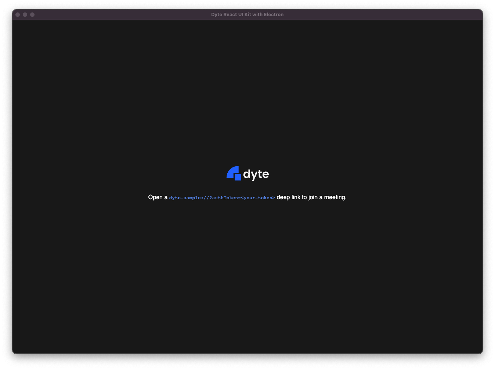
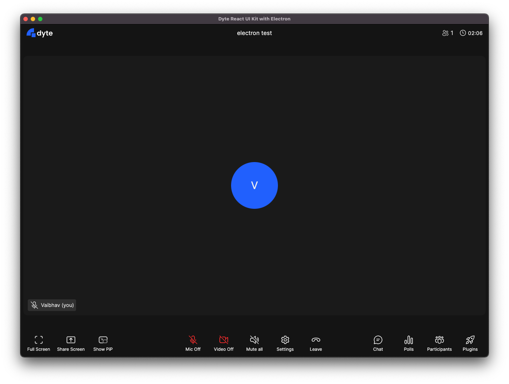

# Default Meeting UI Sample

This sample showcases the simplest way to integrate Dyte's React UI Kit in your
Electron app!

---





## Usage

This sample uses deep links to open up meetings.

An example deep link:

```
dyte-sample://?authToken=<your-token>
```

This sample uses the protocol `dyte-sample://` by default in the
[config.ts](./electron/config.ts) file. Edit it to use your own protocol.

- [See source of React App](./src/App.tsx)
- [See source of Electron main.js](./electron/main/index.ts)
- [See source of Electron preload.js](./electron/preload/index.ts)
