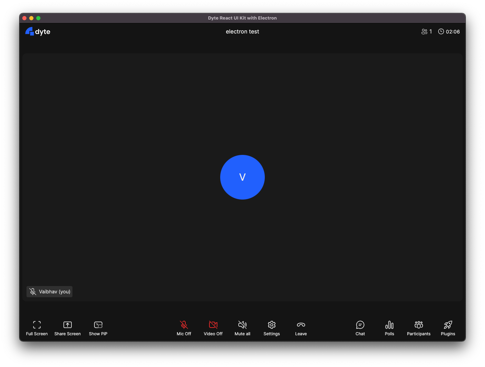

# Default Meeting UI Sample

This sample showcases the simplest way to integrate Dyte's React UI Kit in your
Electron app!

---

Just pop in the `<DyteMeeting />` component, and pass the initialised `meeting`
object to it and you're good to go!

- [See source of React App](./src/App.tsx)
- [See source of Electron main.js](./electron/main/index.ts)
- [See source of Electron preload.js](./electron/preload/index.ts)
